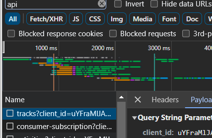

# Simple soundcloud song and playlist downloader
## First time setup
### 1. Get [python](https://python.org)
### 2. git clone this repo or download zip
### 3. install requirements (make sure to be in directory of soundclouddownloader)
```bash
pip install -r requirements.txt
```
### 4. get your own soundcloud client id:
#### go to the soundcloud website, open inspect element and head to network, search up api, and search thru one until u can find client id (can be done with no account)

#### create an env.py file in the same directory as scdl.py, and put
```python
clientid = "CLIENTID"
```
#### replacing CLIENTID with your client id of course

## Usage
### in cmd
```
usage: scdl.py [-h] [--protocol {hls,progressive}] [--format-audio {mpeg,opus}] [--verbose] link

download soundcloud songs and playlists

positional arguments:
  link                  link to the song/playlist

options:
  -h, --help            show this help message and exit
  --protocol {hls,progressive}, -p {hls,progressive}
                        which protocol to use to download (hls is fragmented, progressive is direct link)
  --format-audio {mpeg,opus}, -f {mpeg,opus}
                        which format to download, mpeg being mp3, opus being ogg
  --verbose, -v         whether to directly show downloads happening and whatnot (if off only shows progress of downloading every song    
                        in playlist)
```

### in python
```python
import sys, os, asyncio
sys.path.append('/path/to/soundclouddownloader')
from scdl import scdl
result = asyncio.run(scdl.download(link, protocol, format_audio, verbose))

#in async function
async def main():
    result = await scdl.download(link, protocol, format_audio, verbose)
```
